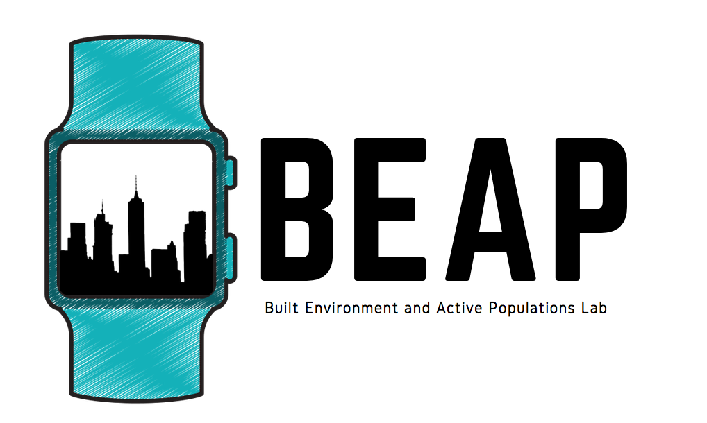

Physical Activity and Data Science
========================================================
author: BEAP Lab
date: May 9-10, 2019
autosize: true

Welcome
========================================================


So excited, so afraid
========================================================
<iframe src="https://giphy.com/embed/1uyFaGpt2ilmE" width="576" height="576" frameBorder="0" class="giphy-embed" allowFullScreen></iframe><p><a href="https://giphy.com/gifs/grandma-1uyFaGpt2ilmE"></a></p>

Questions and interactions 
========================================================
<iframe src="https://giphy.com/embed/7PfwoiCwBp6Ra" width="576" height="460" frameBorder="0" class="giphy-embed" allowFullScreen></iframe><p><a href="https://giphy.com/gifs/ellen-degeneres-questions-ask-7PfwoiCwBp6Ra"></a></p>

Introduction 
========================================================
* Name
* Why you chose this course
* Experience with computer code

Accelerometers 
========================================================
* All phones have them (new phones have 2-3)
* Measure physical activity, sleep, and sedentary behaviour
* Provide lots of cool data

Accelerometers 
========================================================
<iframe width="680" height="420" src="https://www.youtube.com/embed/KZVgKu6v808" frameborder="0" allow="accelerometer; autoplay; encrypted-media; gyroscope; picture-in-picture" allowfullscreen></iframe>

SenseDoc 
========================================================


SenseDoc 
========================================================
* Easy to configure and download data
* Lots of user control
* Fixed position on the body
* Global Positioning System 

SenseDoc Setup 
========================================================
* Only works on PC
* We have setup most of the devices
* Will walk through setup of one device

Data Collection
========================================================
<iframe src="https://giphy.com/embed/lMTtFs2PJVu9O" width="480" height="360" frameBorder="0" class="giphy-embed" allowFullScreen></iframe><p><a href="https://giphy.com/gifs/credit-lMTtFs2PJVu9O"></a></p>

Data Download
========================================================
* Plug in your SenseDoc
* Export the data to desktop
    * Name it something reasonable
* Check the file
    * How might you do that?

R and RStudio
========================================================
The [R project for statistical computing](https://www.r-project.org/) is a free open source statistical programming language and project. 

<iframe src="https://player.vimeo.com/video/97166163?color=428bca&title=0&byline=0&portrait=0" width="640" height="360" frameborder="0" webkitallowfullscreen mozallowfullscreen allowfullscreen></iframe>
<p><a href="https://vimeo.com/97166163"></a></p>

R and RStudio
========================================================
* 2 types of coding
    * Base R
    * Tidyverse
* We will be using [Tidyverse](https://www.tidyverse.org/packages/)
* Lots of online tutorials
    * [@AmeliaMN](https://twitter.com/AmeliaMN)
        * https://github.com/AmeliaMN/IntroToR/blob/master/README.md

Good habits
========================================================
* Name things
* Use a case convention
    * We will use `snake_case`
* Use tidy data principles

In your groups
========================================================
- Peer programming
- Pick a driver for now 
- Pick who's data you will use

Super Quick Overview of RStudio
========================================================

R 
========================================================
You can use R as a basic calculator. If you pass the command 2+2 it will return 4. 

```r
2+2
```

```
[1] 4
```

R 
========================================================
You can use arithmetic and mathematical operators in your commands  

Code  | Action
------------- | -------------
+  | Addition
-  | Subtraction
_*_  | Multiplication
/  | Division
^  | Raise to the power of

R 
========================================================

```r
2^4
```

```
[1] 16
```

Packages
========================================================
Packages let you do things. If you have thought about doing it, there is a package already. There are two basic steps to using a package: 

* Installing the package  
    * `install.packages("tidyverse")`
* Loading the package     
    * `library(tidyverse)`

Anatomy of a R call
========================================================

```r
accel_data <- read_csv("/Users/dfuller/Desktop/accel_data.csv")
```

Code  | Description
------------- | -------------
`accel_data`  | Name of the object to save to memory 
`<-`  | Left assignment operator. Use it to store an object  
`read_csv`  | A function that does something   
`("/Users/dfuller/Desktop/accel_data.csv")`  | The object or location of the object the function should be applied to 

Read in some data
========================================================
Mac

```r
accel_data <- read_csv("/Users/dfuller/Desktop/accel_data.csv")
```

PC 

```r
accel_data <- read_csv("C:\\Users\\Andrie\\Desktop\\accel_data.csv")
```

Data description
========================================================
* rowid: unique identifier for each row
* utcdate: the data to the second in utc time
* ts: second of measurement to 13 decimal places
* x: the x axis of acceleration measured in g units of gravity (1g = 9.81m/s^2)
* y: the x axis of acceleration measured in g 
* z: the x axis of acceleration measured in g 

Check the data
========================================================

```r
head(accel_data)
```

Mean and standard deviation for x axis
========================================================

```r
mean(data$xcounts)
```

Mean and standard deviation for x axis
========================================================

```r
accel_mean_x <- accel_data %>% 
                summarize(
                  x_mean = mean(x),
                  x_sd = sd(x)
                )

head(accel_mean_x)
```

Mean and standard deviation all axes
========================================================

```r
accel_mean <- accel_data %>% 
                summarize(
                  x_mean = mean(x),
                  y_mean = mean(y),
                  z_mean = mean(z),
                  x_sd = sd(x),
                  y_sd = sd(y),
                  z_sd = sd(z),
                )

head(accel_mean)
```

Create a plot of the histogram of X
========================================================

```r
accel_hist_x <- ggplot(accel_data) + 
                  geom_histogram(aes(x))
plot(accel_hist_x)
```

Create a plot of the desnity plot of X
========================================================

```r
accel_dens_x <- ggplot(accel_data) + 
                  geom_density(aes(x), colour = "blue")
plot(accel_dens_x)
```

Create a plot of the desnity plot of X, Y, and Z
========================================================

```r
accel_hist <- ggplot(accel_data) + 
                  geom_density(aes(x), colour = "blue") + 
                  geom_density(aes(y), colour = "red") + 
                  geom_density(aes(z), colour = "purple")
plot(accel_hist)
```

Plot of the x axis over time
========================================================

```r
accel_plot_x <- ggplot(accel_data) + 
                  geom_point(aes(x = utcdate, y = x), colour = "blue", alpha = 0.1)
plot(accel_plot_x)
```

Plot of the all axes over time
========================================================

```r
accel_plot <- ggplot(accel_data) + 
                  geom_point(aes(x = utcdate, y = x), colour = "blue", alpha = 0.1) + 
                  geom_point(aes(x = utcdate, y = y), colour = "red", alpha = 0.1) + 
                  geom_point(aes(x = utcdate, y = z), colour = "green", alpha = 0.1) 
plot(accel_plot)
```

We are doing awesome! 
========================================================
<iframe src="https://giphy.com/embed/mXnO9IiWWarkI" width="480" height="324" frameBorder="0" class="giphy-embed" allowFullScreen></iframe><p><a href="https://giphy.com/gifs/trolli-lego-trolli-weirdly-awesome-mXnO9IiWWarkI"></a></p>

Run the same analysis on another team members data
========================================================

Day 2
========================================================
<iframe src="https://giphy.com/embed/VxbvpfaTTo3le" width="480" height="262" frameBorder="0" class="giphy-embed" allowFullScreen></iframe><p><a href="https://giphy.com/gifs/cat-kitten-kitty-VxbvpfaTTo3le"></a></p>

GPS Data
========================================================
<iframe width="560" height="315" src="https://www.youtube.com/embed/cTrsvGytGG0" frameborder="0" allow="accelerometer; autoplay; encrypted-media; gyroscope; picture-in-picture" allowfullscreen></iframe>

Setup SenseDoc
========================================================

Scavenger Hunt
========================================================
* Walk to the Clock Tower
* Walk through the UC
* Walk around the duck pond
* Walk to the Tim's in the Aquarena
* Come back

Data Download
========================================================
* Plug in your SenseDoc
* Export the data to desktop
    * Name it something reasonable
* Check the file
    * How might you do that?

In your groups
========================================================
- Peer programming
- Pick a driver for now 
- Pick who's data you will use

Read in the data
========================================================

```r
gps_data <- read_csv("/Users/dfuller/Desktop/gps_data.csv")
```

Mean and standard deviation of speed
========================================================

```r
??????
```

Plot the lat and lon data
========================================================

```r
gps_plot_1 <- ggplot(gps_data) + 
                  geom_point(aes(x = lon, y = lat))
plot(gps_plot_1)
```

Get Google Maps
========================================================
Need a Google Maps API Key 

```r
avalon_basemap <- get_map(location = "St. John's, Newfoundland, Canada",
                     source = "google",
                     maptype = "roadmap", 
                     crop = FALSE,
                     zoom = 14)
plot(avalon_basemap)
```

Combine the ggplot and the Google map
========================================================

```r
maps_points <- ggmap(avalon_basemap) + 
                  geom_point(aes(x = lon, y = lat), data = gps_data, alpha = 0.2)

plot(maps_points)
```

Colour the plot by speed
========================================================

```r
maps_points <- ggmap(avalon_basemap) + 
                  geom_point(aes(x = lon, y = lat, colour = speed), data = gps_data, alpha = 0.2)

plot(maps_points)
```
