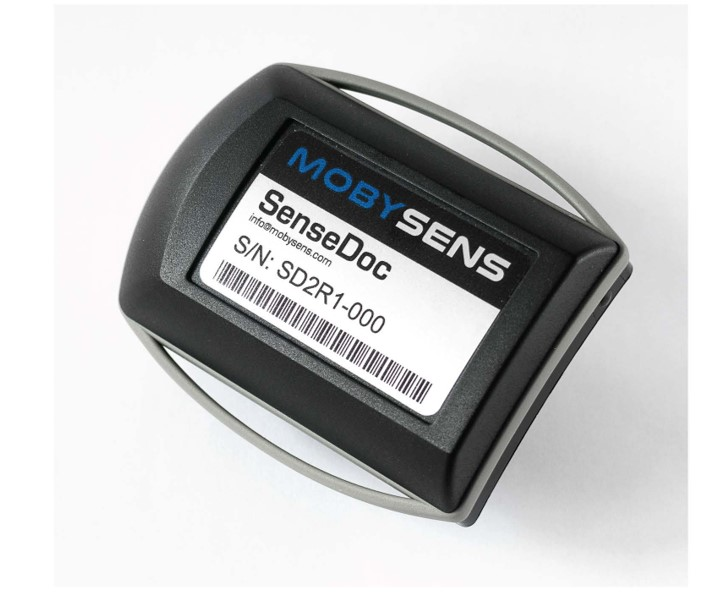

Physical Activity and Data Science
========================================================
author: BEAP Lab
date: May 9-10, 2019
autosize: true

Welcome
========================================================


So excited, so afraid
========================================================
<iframe src="https://giphy.com/embed/1uyFaGpt2ilmE" width="576" height="576" frameBorder="0" class="giphy-embed" allowFullScreen></iframe><p><a href="https://giphy.com/gifs/grandma-1uyFaGpt2ilmE"></a></p>

Questions and interactions 
========================================================
<iframe src="https://giphy.com/embed/7PfwoiCwBp6Ra" width="576" height="460" frameBorder="0" class="giphy-embed" allowFullScreen></iframe><p><a href="https://giphy.com/gifs/ellen-degeneres-questions-ask-7PfwoiCwBp6Ra"></a></p>

Schedule 
========================================================
* 9:00-9:30 - Introductions 
* 9:30-10:30 - Accelerometer setup
* 10:30-11:15 - Data collection
* 11:15-12:00 - Data download and setup
* 12:00-13:00 - Lunch
* 13:00-14:00 - R and RStudio
* 14:00-14:15 - Break
* 14:15-15:00 - Make a plot

Introduction 
========================================================
* Name
* Why you chose this course
* Experience with computer code

Accelerometers 
========================================================
* All phones have them (new phones have 2-3)
* Measure physical activity, sleep, and sedentary behaviour
* Provide lots of cool data

Accelerometers 
========================================================
<iframe width="680" height="420" src="https://www.youtube.com/embed/KZVgKu6v808" frameborder="0" allow="accelerometer; autoplay; encrypted-media; gyroscope; picture-in-picture" allowfullscreen></iframe>

SenseDoc 
========================================================


SenseDoc 
========================================================
* Easy to configure and download data
* Lots of user control
* Fixed position on the body
* Global Positioning System 

SenseDoc Setup 
========================================================
* Only works on PC
* We have setup most of the devices
* Will walk through setup of one device

Data Collection
========================================================
<iframe src="https://giphy.com/embed/lMTtFs2PJVu9O" width="480" height="360" frameBorder="0" class="giphy-embed" allowFullScreen></iframe><p><a href="https://giphy.com/gifs/credit-lMTtFs2PJVu9O"></a></p>

Data Download
========================================================
* Plug in your SenseDoc
* Export the data to desktop
    * Name it something reasonable
* Check the file
    * How might you do that?

R and RStudio
========================================================
The [R project for statistical computing](https://www.r-project.org/) is a free open source statistical programming language and project. 

<iframe src="https://player.vimeo.com/video/97166163?color=428bca&title=0&byline=0&portrait=0" width="640" height="360" frameborder="0" webkitallowfullscreen mozallowfullscreen allowfullscreen></iframe>
<p><a href="https://vimeo.com/97166163"></a></p>

R and RStudio
========================================================
* 2 types of coding
    * Base R
    * Tidyverse
* We will be using [Tidyverse](https://www.tidyverse.org/packages/)
* Lots of online tutorials
    * [@AmeliaMN](https://twitter.com/AmeliaMN)
        * https://github.com/AmeliaMN/IntroToR/blob/master/README.md

Good habits
========================================================
* Name things
* Use a case convention
    * We will use `snake_case`
* Use tidy data principles

Super Quick Overview of RStudio
========================================================


R 
========================================================
You can use R as a basic calculator. If you pass the command 2+2 it will return 4. 

```r
2+2
```

```
[1] 4
```

R 
========================================================
You can use arithmetic and mathematical operators in your commands  

Code  | Actionf
------------- | -------------
+  | Addition
-  | Subtraction
_*_  | Multiplication
/  | Division
^  | Raise to the power of

R 
========================================================

```r
2^6
```

```
[1] 64
```

Packages
========================================================
Packages let you do things. If you have thought about doing it, there is a package already. There are two basic steps to using a package: 

* Installing the package  
    * `install.packages("tidyverse")`
* Loading the package     
    * `library(tidyverse)`
    
Read in some data
========================================================
Mac
```
data <- read_csv("/Users/dfuller/Desktop/mydata.csv")
```

PC 
```
data <- read_csv("C:\\Users\\Andrie\\Desktop\\mydata.csv")
```

Check the data
========================================================
```
tibble(mydata)
```
