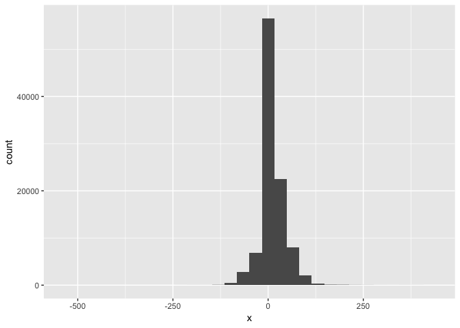
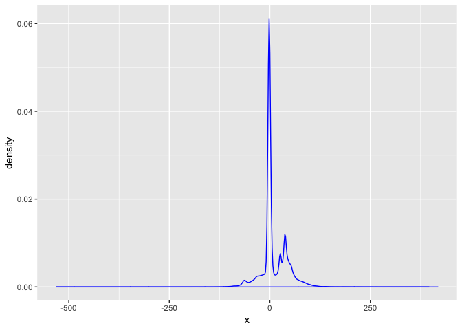
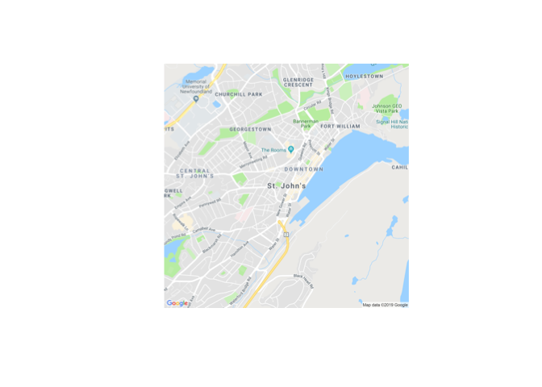
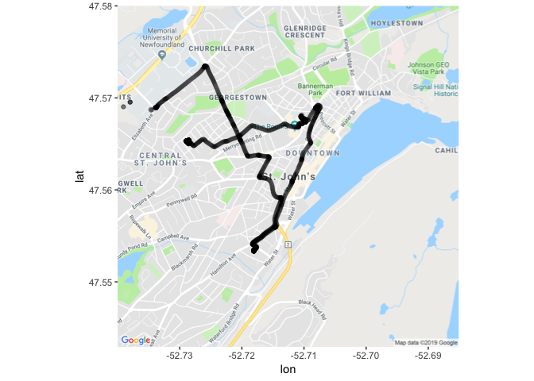
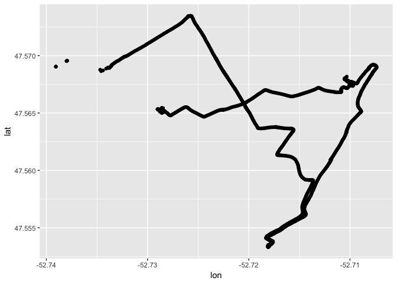

```r
knitr::opts_chunk$set(echo = TRUE)
```

# Answer key for Physical Activity Data Science Workshop

## Get the libraries we need

```r
library(tidyverse)
```

```
## ── Attaching packages ──────────────────────────────────────────────────────────────────── tidyverse 1.2.1 ──
```

```
## ✔ ggplot2 3.1.0       ✔ purrr   0.3.1  
## ✔ tibble  2.0.1       ✔ dplyr   0.8.0.1
## ✔ tidyr   0.8.3       ✔ stringr 1.4.0  
## ✔ readr   1.3.1       ✔ forcats 0.4.0
```

```
## ── Conflicts ─────────────────────────────────────────────────────────────────────── tidyverse_conflicts() ──
## ✖ dplyr::filter() masks stats::filter()
## ✖ dplyr::lag()    masks stats::lag()
```

```r
library(ggmap)
```

```
## Google's Terms of Service: https://cloud.google.com/maps-platform/terms/.
```

```
## Please cite ggmap if you use it! See citation("ggmap") for details.
```

## Accelerometer data section

### Read in the data

```r
accel_data <- read_csv("accel_data_example.csv")
```

```
## Parsed with column specification:
## cols(
##   rowid = col_double(),
##   utcdate = col_datetime(format = ""),
##   ts = col_double(),
##   x = col_double(),
##   y = col_double(),
##   z = col_double()
## )
```

### Show the first 6 rows

```r
head(accel_data)
```

```
## # A tibble: 6 x 6
##   rowid utcdate                  ts     x     y     z
##   <dbl> <dttm>                <dbl> <dbl> <dbl> <dbl>
## 1     1 2018-08-02 16:16:50 3.10e13   -42  -117  -443
## 2     2 2018-08-02 16:16:50 3.10e13    16   -92  -431
## 3     3 2018-08-02 16:16:50 3.10e13    22     0  -440
## 4     4 2018-08-02 16:16:50 3.10e13    26     0  -470
## 5     5 2018-08-02 16:16:50 3.10e13    33    12  -428
## 6     6 2018-08-02 16:16:50 3.10e13    53    98  -443
```

### Accel Data description
* rowid: unique identifier for each row
* utcdate: the data to the second in utc time
* ts: second of measurement to 13 decimal places
* x: the x axis of acceleration measured in g units of gravity (1g = 9.81m/s^2)
* y: the x axis of acceleration measured in g 
* z: the x axis of acceleration measured in g 

### Exploring x,y,z

Calculate the mean and standard deviation for the x axis and create a new data frame. 

```r
accel_mean_x <- accel_data %>% 
                summarize(
                  x_mean = mean(x),
                  x_sd = sd(x)
                )

head(accel_mean_x)
```

```
## # A tibble: 1 x 2
##   x_mean  x_sd
##    <dbl> <dbl>
## 1   10.4  32.4
```

Calculate the mean and standard deviation for all variables and create a new data frame. 

```r
accel_mean <- accel_data %>% 
                summarize(
                  x_mean = mean(x),
                  y_mean = mean(y),
                  z_mean = mean(z),
                  x_sd = sd(x),
                  y_sd = sd(y),
                  z_sd = sd(z),
                )
head(accel_mean)
```

```
## # A tibble: 1 x 6
##   x_mean y_mean z_mean  x_sd  y_sd  z_sd
##    <dbl>  <dbl>  <dbl> <dbl> <dbl> <dbl>
## 1   10.4  -135.  -221.  32.4  34.7  32.3
```

### Create a plot of the x axis over time with time on the x axis and acceleration 

```r
accel_plot_x <- ggplot(accel_data) + 
                  geom_point(aes(x = utcdate, y = x), colour = "blue", alpha = 0.1)
plot(accel_plot_x)
```

<!-- -->

Cool. Now we can add all the other axes and see them together. 

```r
accel_plot <- ggplot(accel_data) + 
                  geom_point(aes(x = utcdate, y = x), colour = "blue", alpha = 0.1) + 
                  geom_point(aes(x = utcdate, y = y), colour = "red", alpha = 0.1) + 
                  geom_point(aes(x = utcdate, y = z), colour = "green", alpha = 0.1) 
plot(accel_plot)
```

<!-- -->

## GPS data section

### Read in the data

```r
gps_data <- read_csv("gps_data_example.csv")
```

```
## Parsed with column specification:
## cols(
##   ts = col_double(),
##   utcdate = col_datetime(format = ""),
##   lat = col_double(),
##   lon = col_double(),
##   speed = col_double(),
##   course = col_double(),
##   mode = col_character(),
##   fix = col_character(),
##   alt = col_double(),
##   mode1 = col_character(),
##   mode2 = col_double(),
##   sat_used = col_double(),
##   pdop = col_double(),
##   hdop = col_double(),
##   vdop = col_double(),
##   sat_in_view = col_double()
## )
```

### Check out the data

```r
head(gps_data) 
```

```
## # A tibble: 6 x 16
##        ts utcdate               lat   lon speed course mode  fix     alt
##     <dbl> <dttm>              <dbl> <dbl> <dbl>  <dbl> <chr> <chr> <dbl>
## 1 3.10e13 2018-08-02 16:59:49  47.6 -52.7  2.76    -1  A     A      360 
## 2 3.10e13 2018-08-02 16:59:50  47.6 -52.7  2.91    -1  A     A      360 
## 3 3.10e13 2018-08-02 16:59:51  47.6 -52.7  2.8     -1  A     A      360.
## 4 3.10e13 2018-08-02 16:59:52  47.6 -52.7  2.9     -1  A     A      360.
## 5 3.10e13 2018-08-02 16:59:53  47.6 -52.7  3.01   221. A     A      360.
## 6 3.10e13 2018-08-02 17:00:56  47.6 -52.7  2.38    -1  A     A      362.
## # … with 7 more variables: mode1 <chr>, mode2 <dbl>, sat_used <dbl>,
## #   pdop <dbl>, hdop <dbl>, vdop <dbl>, sat_in_view <dbl>
```

### Missing data

I know there is missing data. We are going to remove all missing. If you had

```r
gps_data <- gps_data %>% 
              drop_na()
```

### GPS Data description
* ts: second of measurement to 13 decimal places
* utcdate: the data to the second in utc time
* lat: the latitude 
    * geographic coordinate that specifies the north–south position of a point on the Earth's surface.
* lon: the longitude
    * geographic coordinate that specifies the east–west position of a point on the Earth's surface.
* sat_used: number of satellites used to fix the lat and lon coordinates

### Calculate the mean and standard deviation of speed

```r
gps_mean_x <- gps_data %>% 
                summarize(
                  speed_mean = mean(speed),
                  speed_sd = sd(speed)
                )

head(gps_mean_x)
```

```
## # A tibble: 1 x 2
##   speed_mean speed_sd
##        <dbl>    <dbl>
## 1      0.472     2.24
```

### Make a plot of the lat and lon data

Which axes should we have on the x and y axes

```r
gps_plot_1 <- ggplot(gps_data) + 
                  geom_point(aes(x = lon, y = lat))
plot(gps_plot_1)
```

<!-- -->

### Connect with Google Maps using `ggmap` 

```r
avalon_basemap <- get_map(location = "St. John's, Newfoundland, Canada",
                     source = "google",
                     maptype = "roadmap", crop = FALSE,
                     zoom = 14)
```

```
## Source : https://maps.googleapis.com/maps/api/staticmap?center=St.%20John's,%20Newfoundland,%20Canada&zoom=14&size=640x640&scale=2&maptype=roadmap&language=en-EN&key=xxx-A5x5M7s
```

```
## Source : https://maps.googleapis.com/maps/api/geocode/json?address=St.+John's,+Newfoundland,+Canada&key=xxx-A5x5M7s
```

```r
plot(avalon_basemap)
```

<!-- -->

### Combine ggmap with points

```r
maps_points <- ggmap(avalon_basemap) + 
                  geom_point(aes(x = lon, y = lat), data = gps_data, alpha = 0.2)

plot(maps_points)
```

<!-- -->

### Colour GPS data by speed

```r
maps_speed <- ggmap(avalon_basemap) + 
                  geom_point(aes(x = lon, y = lat, colour = speed), data = gps_data, alpha = 0.2)

plot(maps_speed)
```

<!-- -->


