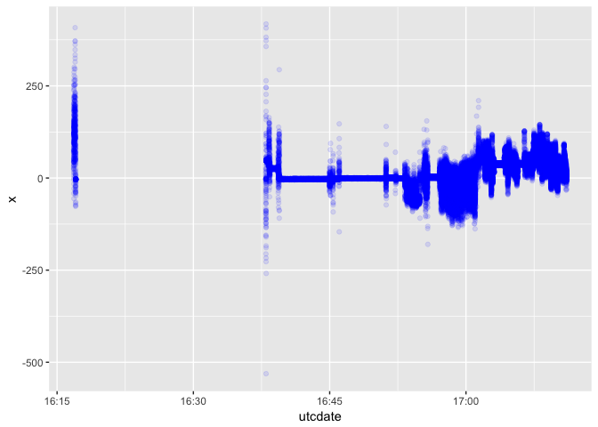

## Answer key for Physical Activity Data Science Workshop

### Read in the data

```r
accel_data <- read_csv("accel_data_example.csv")
```

```
## Parsed with column specification:
## cols(
##   rowid = col_integer(),
##   utcdate = col_datetime(format = ""),
##   ts = col_double(),
##   x = col_integer(),
##   y = col_integer(),
##   z = col_integer()
## )
```

### Show the first 6 rows

```r
head(accel_data)
```

```
## # A tibble: 6 x 6
##   rowid utcdate                  ts     x     y     z
##   <int> <dttm>                <dbl> <int> <int> <int>
## 1     1 2018-08-02 16:16:50 3.10e13   -42  -117  -443
## 2     2 2018-08-02 16:16:50 3.10e13    16   -92  -431
## 3     3 2018-08-02 16:16:50 3.10e13    22     0  -440
## 4     4 2018-08-02 16:16:50 3.10e13    26     0  -470
## 5     5 2018-08-02 16:16:50 3.10e13    33    12  -428
## 6     6 2018-08-02 16:16:50 3.10e13    53    98  -443
```

### Exploring x,y,z

Calculate the mean and standard deviation for the x axis and create a new data frame. 

```r
accel_mean_x <- accel_data %>% 
                summarize(
                  x_mean = mean(x),
                  x_sd = sd(x)
                )
head(accel_mean_x)
```

```
## # A tibble: 1 x 2
##   x_mean  x_sd
##    <dbl> <dbl>
## 1   10.4  32.4
```

Calculate the mean and standard deviation for all variables and create a new data frame. 

```r
accel_mean <- accel_data %>% 
                summarize(
                  x_mean = mean(x),
                  y_mean = mean(y),
                  z_mean = mean(z),
                  x_sd = sd(x),
                  y_sd = sd(y),
                  z_sd = sd(z),
                )
head(accel_mean)
```

```
## # A tibble: 1 x 6
##   x_mean y_mean z_mean  x_sd  y_sd  z_sd
##    <dbl>  <dbl>  <dbl> <dbl> <dbl> <dbl>
## 1   10.4  -135.  -221.  32.4  34.7  32.3
```

### Create a plot of the x axis over time with time on the x axis and acceleration 

```r
accel_plot_x <- ggplot(accel_data) + 
                  geom_point(aes(x = utcdate, y = x), colour = "blue", alpha = 0.1)
plot(accel_plot_x)
```

<!-- -->

Cool. Now we can add all the other axes and see them together. 

```r
accel_plot <- ggplot(accel_data) + 
                  geom_point(aes(x = utcdate, y = x), colour = "blue", alpha = 0.1) + 
                  geom_point(aes(x = utcdate, y = y), colour = "red", alpha = 0.1) + 
                  geom_point(aes(x = utcdate, y = z), colour = "green", alpha = 0.1) 
plot(accel_plot)
```

<!-- -->


